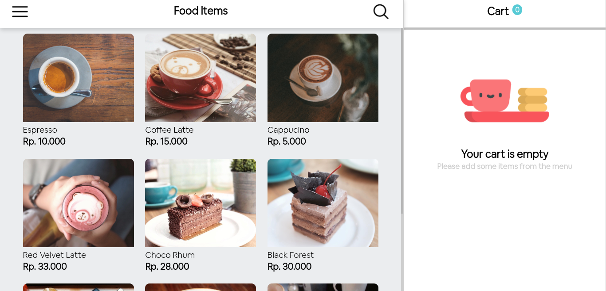
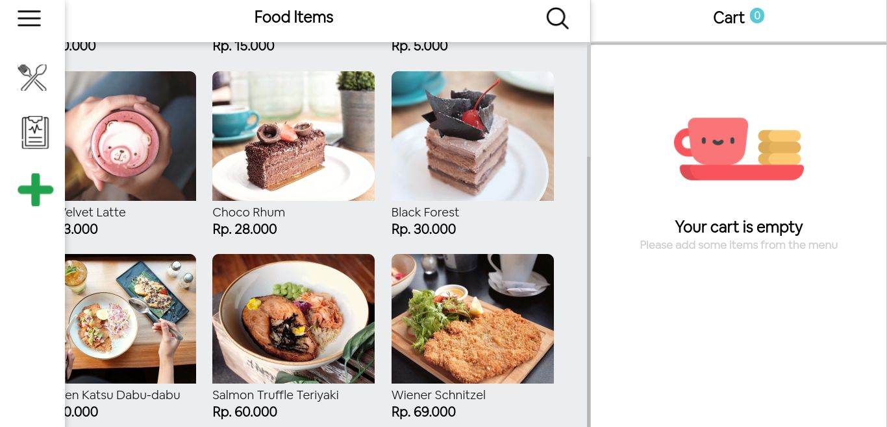
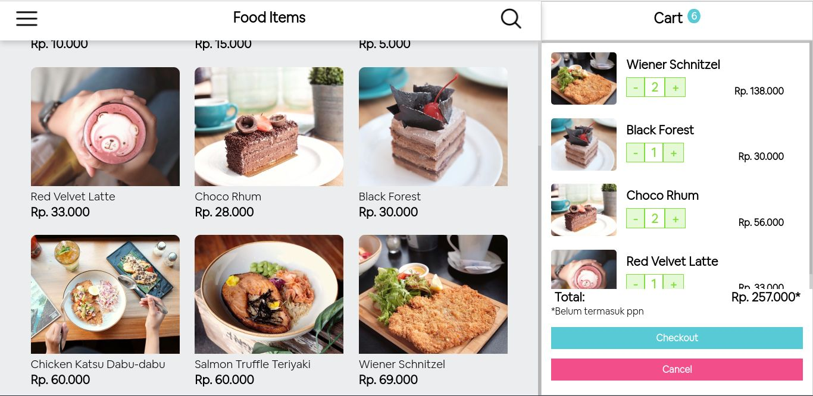
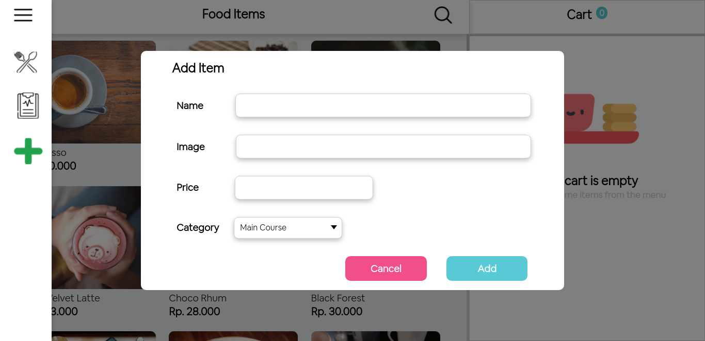

# POS App! Ordering Foods In No Time.

**POS App** is a website based application for ordering foods made with love for those who need to eat fancy foods and drinks anywhere and anytime. It was built with **HTML**, **CSS**, and **JavaScript** that implemented in **DOM**.

## Web Application Pages

Pages that currently available in **POS App**:

- **Home**, you can pick menu from this page, add it into cart, and process your order. You can also navigate to other pages.

## Snippets

Here are some snippets about this app:

### Home

### Home with Sidebar Menu

### Home with Filled Cart

### Home with Add New Menu Modal

## POS App Update!

Hello there! **POS App** is currently in development process.

Last Update: Monday, 06/12/2021
